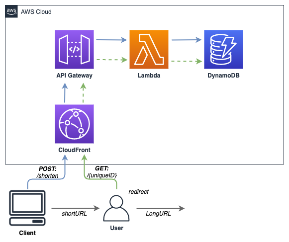

# Serverless URL Shortener

A Serverless URL Shortener service which allows you to deploy a URL Shortener in AWS using Serverless Framework

For the following example domain of `example.com` to genenerate short urls i.e. `https://example.com/tpXckS`

Supports click analytics visualisations and downloadable CSVs

# Technology Stack

- Cloudfront
- DynamoDB
- Lambda
- Route53
- Cloudformation
- Serverless Framework
- Nodejs
- Typescript

# Architecture



# Deployment

There are two options for deployment:

## Prerequisites

- An ACM SSL Ceritificate in us-east-1 for `example.com` - the ARN for the cerificate should be set as the `${CERT_ARN}` variable

_If you require a DNS record to be created for your Cloudfront Distribution_

- A Route53 Hosted Zone ID set as the `${r53hostedzoneid}` variable. e.g. `Z2xxxxDATAQYW2`

# Without Route53 Record

```
npm install
```

```
serverless deploy --stage=${stage} --region=${region} --acmcertarn ${CERT_ARN} --domainname ${DOMAIN_NAME} --creatednsrecord "false"
```

* The CloudFormation Stack outputs the CloudFront domain - directly your short Domain DNS record at this domain name

# With Route53 Record

```
npm install
```

```
serverless deploy --stage=${stage} --region=${region} --acmcertarn ${CERT_ARN} --domainname ${DOMAIN_NAME} --r53hostedzoneid ${ZONE_ID} --creatednsrecord "true"
```

# Usage

When the stack is deployed you will be provided an API key available in the API Gateway console called `key-${stage}`

Example CURL Request:

```
curl --location --request POST 'https://example.com/api/shorten' \
--header 'x-api-key: ${apikey}' \
--header 'Content-Type: text/plain' \
--data-raw '{
  "longurl": "https://www.google.com/search?q=cloud+aws"
}'
```

Response:

```
{
    "longurl": "https://www.google.com/search?q=cloud+aws",
    "id": "Abp5Ow",
    "created": 1876547328,
    "expire": 1896547328,
    "shorturl": "https://example.com/Abp5Ow"
}
```

_The response includes the following:_

`longurl` : The requested long url to be shortened

`id` : The output short unique id for the short url

`created` : The epoch timestamp of creation date

`expire` : The expiry time for the short url (short url will become unavailable after this date / time)

`shorturl` : The short url generated

_Note:_ The default short url expiry is set to now + 3 months. To override the expiry - include this into the request as an epoch timestamp.

Example CURL Request with custom expiry:

```
curl --location --request POST 'https://example.com/api/shorten' \
--header 'x-api-key: ${apikey}' \
--header 'Content-Type: text/plain' \
--data-raw '{
  "longurl": "https://www.google.com/search?q=cloud+aws",
  "expire": 1896547328
}'
```

This record will expire on Saturday, 25 May 2021 21:36:52

_Note:_ Short urls will be cached by Cloudfront for 1 day which means your lambda function invoke / dynamodb get will be cached for a day.